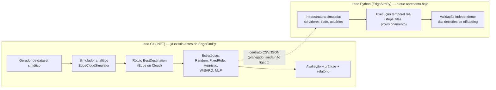
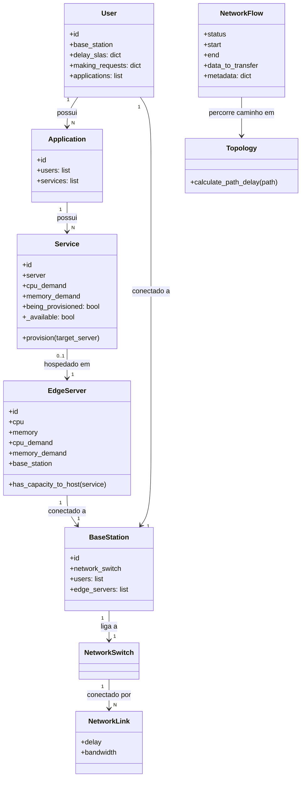
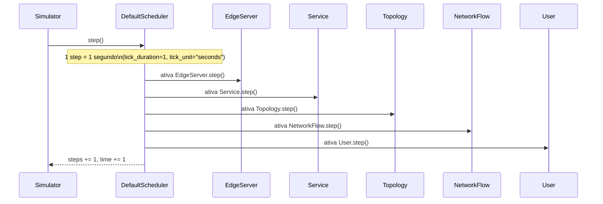
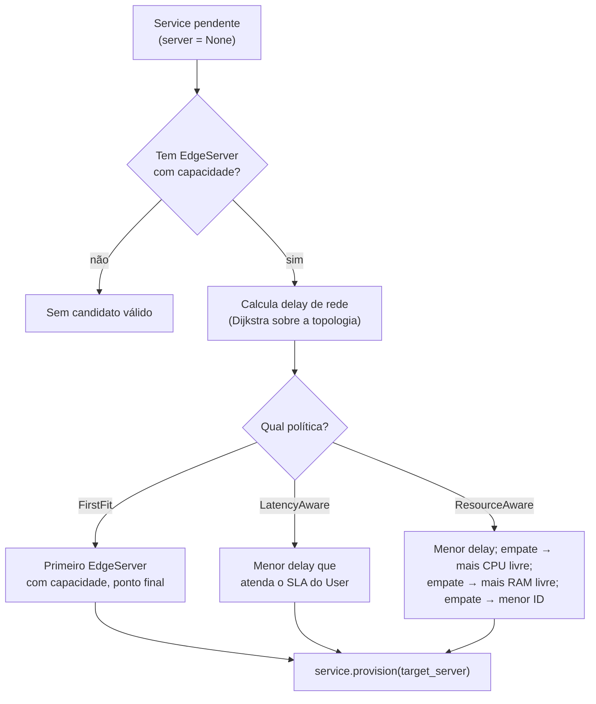
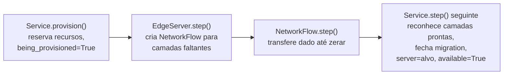
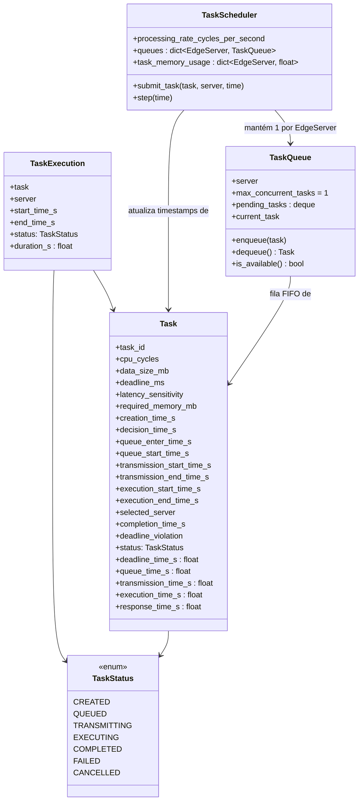
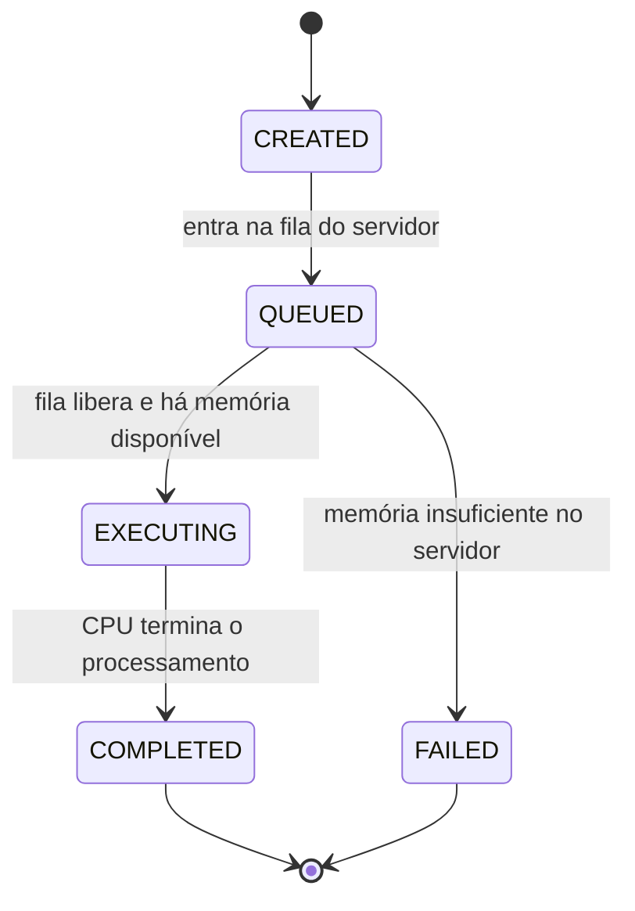
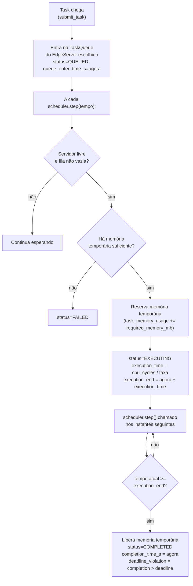
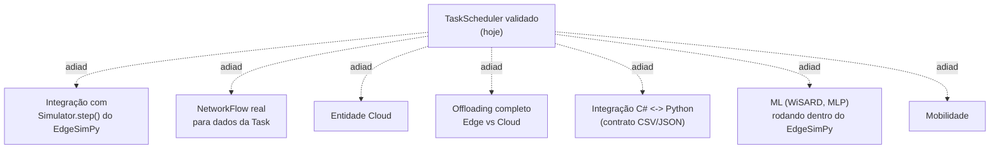

# Apresentação ao orientador — Simulações em EdgeSimPy

> Roteiro de apresentação para explicar, passo a passo, tudo o que foi feito
> em `edgesimpy-simulation/` até agora: conceitos, entidades, componentes,
> fluxos, decisões metodológicas, experimentos e resultados reais.
> Data de referência: 28/08/2026.

---

## 0. Como usar este documento na apresentação

Cada seção corresponde a um "bloco" de fala. A ordem sugerida de apresentação
é a ordem das seções. Analogias do cotidiano foram incluídas para facilitar a
explicação oral — use-as, mas sempre volte ao termo técnico correto logo em
seguida, porque é isso que o orientador vai querer ouvir.

Estrutura da fala (visão geral):

1. Qual é o papel do EdgeSimPy no TCC (por que ele existe ao lado do C#).
2. O que é o EdgeSimPy e quais "peças" ele modela (entidades).
3. Como o tempo passa dentro da simulação (ciclo/scheduler).
4. O que já validamos sobre colocação de serviços (placement).
5. O que descobrimos sobre o provisionamento (uma auditoria importante).
6. O modelo próprio de "Task" que criamos por cima do EdgeSimPy.
7. O escalonador de Tasks (fila, execução, memória) — o trabalho mais recente.
8. O experimento determinístico que prova que tudo funciona.
9. O que **não** fizemos ainda, de propósito.
10. Próximo passo.

---

## 1. Por que existe uma parte em Python/EdgeSimPy neste TCC?

O projeto tem duas metades:



**Analogia do dia a dia:** pense no C# como o *departamento de planejamento*
de uma rede de restaurantes — ele calcula, no papel, "se um pedido for
grande, é mais rápido preparar na cozinha central ou na filial do bairro?".
O EdgeSimPy é o *restaurante de verdade* rodando: fila de clientes, cozinheiro
ocupado, tempo de entrega. Meu trabalho no EdgeSimPy é montar esse
"restaurante de mentirinha" (simulado, mas fiel às regras reais) para
testar se o que o departamento de planejamento calculou realmente se sustenta
quando existe fila, rede e tempo passando de verdade.

**Por que isso importa metodologicamente:** se eu só validasse o modelo de ML
usando a mesma fórmula que gerou os rótulos de treino, estaria sendo
circular — o modelo "aprenderia a copiar a prova". O EdgeSimPy é a segunda
fonte de verdade, independente, que evita essa armadilha.

---

## 2. O que é o EdgeSimPy e quais peças ele modela

**EdgeSimPy 1.1.0** é um simulador de eventos discretos para *Edge Computing*,
publicado academicamente (Souza, Ferreto, Calheiros — FGCS 2023). Ele já
existia pronto; eu não o escrevi, **eu o estudei, auditei o código-fonte real
e construí camadas por cima dele**, sempre validando cada peça isoladamente
antes de avançar.

### 2.1 Diagrama de entidades (o "elenco" da simulação)



**Tradução para o cotidiano** (uma analogia de cidade/entregas):

| Entidade EdgeSimPy | Analogia | Papel na simulação |
|---|---|---|
| `User` | O cliente que faz o pedido | Quem gera a demanda |
| `Application` | O "app de pedidos" que o cliente usa | Agrupa os serviços que o cliente consome |
| `Service` | O prato específico que precisa ser preparado | A unidade que precisa de CPU/memória e precisa estar hospedada em algum lugar |
| `EdgeServer` | A cozinha/filial que prepara o prato | Onde o Service roda; tem capacidade limitada |
| `BaseStation` | O bairro/torre de celular | Ponto de acesso físico que liga clientes e cozinhas à rede |
| `NetworkSwitch` / `NetworkLink` | As ruas e cruzamentos da cidade | Definem por onde a "entrega" (dado) passa e quanto tempo leva (delay) |
| `NetworkFlow` | O motoboy carregando uma entrega específica | Representa uma transferência de dado em andamento (ex.: baixar a "receita"/imagem de container para a cozinha poder preparar o prato) |
| `Topology` | O mapa da cidade inteira | Calcula a rota mais curta e o tempo total de trajeto |

**Ponto importante que descobrimos:** o `NetworkFlow` do EdgeSimPy **não é**
"uma requisição do usuário sendo processada". Ele é usado principalmente para
transferir *camadas de container* (a "receita" que a cozinha precisa baixar
antes de conseguir preparar o prato pela primeira vez) e para migração de
estado. Isso foi uma descoberta central: não podíamos tratar `NetworkFlow`
como se fosse a nossa `Task` — por isso criamos um modelo de `Task` próprio
(seção 6).

---

## 3. Como o tempo passa na simulação (o "relógio" do EdgeSimPy)



**Por que essa ordem importa (achado prático, não teórico):** como
`Service` é ativado **antes** de `NetworkFlow` a cada tick, se um download
termina no passo 7, o `Service` só percebe isso no passo 8. Isso não é um
bug — é a ordem real do código, e verificamos isso lendo o código-fonte, não
confiando apenas na documentação.

**Analogia:** é como um cartório que só olha os processos protocolados **no
início do expediente**. Se um processo terminou às 17h de ontem, ele só será
"reconhecido como concluído" na abertura do expediente de hoje, mesmo já
estando pronto desde ontem.

---

## 4. Placement — "em qual cozinha cada prato vai ser feito?"

Antes de existir a nossa `Task`, o EdgeSimPy já resolve um problema parecido
para `Service`: decidir em qual `EdgeServer` cada `Service` deve ser
hospedado. Isso se chama **placement** e foi o primeiro problema que
estudamos e implementamos, com três políticas comparáveis.



### 4.1 As três políticas, em linguagem simples

- **FirstFit** — *"pego a primeira vaga de estacionamento livre, nem que seja
  longe"*. Simples, determinístico, mas concentra tudo no mesmo lugar.
- **LatencyAwarePlacement** — *"escolho a cozinha mais perto de casa, desde
  que ela consiga entregar dentro do prazo combinado (SLA)"*. Usa caminho
  mais curto (Dijkstra) na topologia de rede real.
- **ResourceAwarePlacement** — igual à anterior, mas quando **empata** em
  distância, desempata olhando primeiro CPU livre, depois RAM livre, depois
  o ID do servidor (para ser 100% reprodutível, sem sorteio).

### 4.2 Resultado real medido (dataset `sample_dataset2.json`, 6 Services)

| Política | Steps até concluir | NetworkFlows criados | Provisionamento médio |
|---|---|---|---|
| FirstFit | 8 | 4 | ~4,0 s (1s, 1s, 7s, 7s, 7s, 7s) |
| LatencyAwarePlacement | 6 | 6 | 4,00 s (2 locais em 0ms, 4 offloads) |
| ResourceAwarePlacement | 6 | 5–6 | 2,00 s |

**Achado que vale ouro para a apresentação:** mais `NetworkFlow`s **não**
significa política pior, e menos **não** significa política melhor — depende
de quantos servidores diferentes precisam baixar a mesma "receita" (imagem de
container) pela primeira vez. É como comparar duas lanchonetes: uma que
compra tudo pronto de um fornecedor único (menos entregas, mas todas para o
mesmo lugar) contra uma rede de lanchonetes que espalha os pedidos (mais
entregas, cada uma para um lugar diferente) — nenhuma das duas é
"automaticamente melhor" só pelo número de entregas.

**Metodologia de reprodutibilidade:** cada política roda em um **processo
Python isolado** (`executar_politica_isolada.py` +
`comparar_politicas_isoladas.py`), para garantir que uma política não deixe
"sujeira" de estado global para a próxima — a mesma preocupação que se tem ao
rodar testes de unidade que não podem compartilhar variáveis globais entre si.

---

## 5. A auditoria do provisionamento — resolvendo um "falso bug"

Durante os testes, aparecia gente com `0s` de tempo de provisionamento. A
primeira suspeita foi: "isso deve ser um erro, falta de dado". Fizemos uma
auditoria dedicada (`diagnostico_ciclo_provisionamento.py`) e descobrimos que
**não era bug**.



**Regra correta encontrada (fato verificado no código):**

```text
tempo de provisionamento = migration.end - migration.start
```

Se o servidor escolhido **já tinha tudo pronto** (nenhuma camada faltando),
`start == end` e o tempo é legitimamente `0s` — não é ausência de dado.
Ausência real de dado deve aparecer como `null`, nunca como `0`.

**Analogia:** é como pedir uma pizza numa pizzaria que já tem a massa pronta
na hora — o "tempo de preparo" registrado pode ser `0 minutos` porque não
faltava nada para começar, e isso é uma medição válida, não um erro do
relógio.

Também fixamos o **critério de conclusão correto**, porque
`service.server != None` sozinho é enganoso (o servidor já é atribuído antes
mesmo do processo terminar):

```text
concluído = (server is not None) AND (_available == True) AND (NOT being_provisioned)
```

---

## 6. O modelo próprio de `Task` — por que criamos isso

O EdgeSimPy nativamente pensa em `User → Application → Service → EdgeServer`,
um modelo *estático*: uma vez que o Service está hospedado, ele fica lá
"ocupando a mesa" indefinidamente. Ele **não tem** o conceito de "uma tarefa
computacional específica, com ciclos de CPU, tamanho, prazo e um resultado",
que é exatamente o que o TCC precisa para comparar decisões de offloading.

**Decisão metodológica (documentada e deliberada):** criar uma entidade
`Task`, no nosso próprio código, **independente** do EdgeSimPy — sem
modificar o código-fonte do framework, sem transformar `Task` em `Service`
prematuramente.

**Analogia:** `Service` é como "a churrasqueira fixa instalada na cozinha"
(existe, ocupa espaço, fica lá). `Task` é "o pedido específico do cliente 42,
às 19h32, pedindo picanha ao ponto, com prazo de 20 minutos" — algo que
nasce, é enfileirado, é processado, e morre (é concluído) tendo um resultado
mensurável (chegou dentro do prazo? quanto tempo levou?).

### 6.1 Diagrama de classes do modelo de Task



### 6.2 Os requisitos da Task vêm do lado C# (mesma linguagem, unidades diferentes)

| Campo da Task (Python, segundos) | Equivalente em `OffloadingSample.cs` |
|---|---|
| `cpu_cycles` | `CpuCycles` |
| `data_size_mb` | `TaskSizeMB` |
| `deadline_ms` | `DeadlineMs` |
| `latency_sensitivity` | `LatencySensitivity` |
| `required_memory_mb` | `RequiredMemoryMB` |

**Cuidado de unidade (relevante para a apresentação):** o lado C# usa
milissegundos para deadline; o relógio da simulação Python usa **segundos**
(igual ao `tick_unit="seconds"` do EdgeSimPy). A conversão é explícita:

```text
deadline_time_s = creation_time_s + deadline_ms / 1000
```

### 6.3 Ciclo de vida de uma Task (diagrama de estados)



(O estado `TRANSMITTING` existe no enum `TaskStatus` para quando, no futuro,
existir transmissão de dados via `NetworkFlow` — ainda não é usado nesta
fase, propositalmente.)

---

## 7. Hipótese explícita: quanto tempo uma Task leva para executar?

Aqui está uma das decisões metodológicas mais importantes do trabalho.

**Fato verificado no código-fonte do EdgeSimPy 1.1.0:** `EdgeServer.cpu` é um
número que representa **capacidade de hospedagem** — quantos `Service`s cabem
ali — e não uma taxa de processamento em ciclos por segundo. O framework
**não define** nativamente "quão rápido" um servidor processa uma tarefa.

**Analogia:** `EdgeServer.cpu = 8` é como dizer "esta cozinha tem 8 bocas de
fogão" — isso me diz quantos pratos cabem sendo preparados ao mesmo tempo,
**não** diz se o cozinheiro é rápido ou lento.

**Decisão tomada:** em vez de inventar silenciosamente uma conversão (o que
seria cientificamente frágil), criamos um parâmetro explícito e documentado
como **hipótese experimental**:

```text
processing_rate_cycles_per_second   (ex.: 300.000.000 ciclos/segundo)

execution_time_s = cpu_cycles / processing_rate_cycles_per_second
```

**Analogia do padeiro:** "este forno assa pães a uma taxa de X pães por
hora" é uma hipótese que eu declaro e posso variar em experimentos — não é
uma propriedade física do forno que eu inventei e escondi. Isso permite, no
futuro, testar servidores com velocidades diferentes sem reescrever o
modelo.

---

## 8. O escalonador de Tasks — fila FIFO, uma de cada vez, memória temporária

Esta é a implementação mais recente (Fase 5, concluída em 28/08/2026):
`TaskExecution`, `TaskQueue` e `TaskScheduler`.

### 8.1 Por que FIFO e por que uma Task por vez?

**Decisão metodológica deliberada, não limitação técnica:** começamos pelo
caso mais simples possível — um caixa de banco (`max_concurrent_tasks = 1`)
atendendo em ordem de chegada (FIFO), sem prioridade, sem preempção. Isso
permite validar corretamente `queue_time`, `execution_time`,
`response_time` e violação de deadline **antes** de somar a complexidade de
paralelismo.

**Analogia:** é o caixa único de uma padaria pequena — o segundo cliente da
fila só é atendido quando o primeiro termina, nunca ao mesmo tempo. Depois
que provarmos que o relógio da fila está correto com um caixa só, faz
sentido testar com vários caixas (paralelismo) — mas não antes.

### 8.2 Fluxo completo de uma submissão de Task



### 8.3 Separação que evitamos misturar: memória de Task vs memória de Service

| Conceito | O que é | Quem gerencia | Quando existe |
|---|---|---|---|
| `Service.memory_demand` | Memória **permanente** reservada por um Service hospedado | O próprio EdgeSimPy | Enquanto o Service estiver provisionado no servidor |
| `TaskScheduler.task_memory_usage` | Memória **temporária** usada só durante a execução de uma Task | Nosso `TaskScheduler` | Só entre `execution_start` e `execution_end` |

**Analogia:** `Service.memory_demand` é a mesa reservada permanentemente para
um cliente VIP no restaurante (ocupada o tempo todo). A memória de Task é uma
bandeja emprestada da cozinha só enquanto aquele prato específico está sendo
montado — pega emprestada, devolvida assim que o prato sai. Nunca somamos as
duas contas de forma ingênua; elas são checadas juntas
(`server.memory - server.memory_demand - task_memory_usage`) para saber se
sobra espaço para uma nova Task.

**CPU não é ocupado pela Task** (deliberadamente): só a memória temporária é
reservada; `cpu_demand` do EdgeServer não é tocado pela Task, porque hospedar
(Service) e executar (Task) foram mantidos como conceitos separados nesta
fase.

---

## 9. O experimento determinístico que prova que o escalonador funciona

Arquivo: `edgesimpy-simulation/src/diagnostico_task_scheduler.py`. Duas
Tasks, mesmo servidor (`EdgeServer_3`), taxa de processamento de
`300.000.000` ciclos/segundo, ambas submetidas no instante `0.0s`.

| Parâmetro | Task 1 (`task-001`) | Task 2 (`task-002`) |
|---|---|---|
| `cpu_cycles` | 600.000.000 | 300.000.000 |
| `required_memory_mb` | 256 MB | 512 MB |
| `deadline_ms` | 2.500 ms (2,5s) | 4.000 ms (4,0s) |

### 9.1 Linha do tempo observada (resultado real, não hipotético)

```mermaid
gantt
    dateFormat  X
    axisFormat %Ls
    title Cronograma real do escalonador (segundos simulados)
    section EdgeServer_3
    Task 1 em fila (queue=0s)      :done, q1, 0, 0
    Task 1 executando (2s)         :active, e1, 0, 2
    Task 2 em fila (aguardando)    :crit, q2, 0, 2
    Task 2 executando (1s)         :active, e2, 2, 3
```



### 9.2 Métricas medidas vs esperadas (bateu 100%)

| Métrica | Task 1 | Task 2 |
|---|---|---|
| Queue Time | 0s ✅ | 2s ✅ (esperou a Task 1 terminar) |
| Execution Time | 2s ✅ (600M / 300M) | 1s ✅ (300M / 300M) |
| Response Time | 2s ✅ | 3s ✅ |
| Memória durante execução | 256 MB | 512 MB (após liberar os 256 MB da Task 1) |

**Analogia final para fechar esta parte:** é exatamente a fila do caixa único
— o cliente 1 chega e é atendido na hora (fila=0), leva 2 minutos. O cliente
2 chega junto, mas só começa a ser atendido quando o caixa libera (fila=2
minutos), e como o pedido dele é mais rápido de processar, termina em mais 1
minuto (execução=1 min), totalizando 3 minutos desde que chegou.

### 9.3 Bateria de testes obrigatórios (todos passando)

Arquivo: `src/test_task_scheduler.py`.

| Teste | O que valida | Resultado |
|---|---|---|
| A — Uma Task | Fila zero, execução e resposta corretas quando não há concorrência | ✅ |
| B — Duas Tasks, mesmo servidor | FIFO real: a segunda espera a primeira terminar | ✅ |
| C — Violação de deadline | Task que estoura o prazo é sinalizada corretamente | ✅ |
| D — Memória temporária | Reserva durante execução, libera exatamente ao final | ✅ |
| E — Servidores diferentes | Filas de servidores diferentes não se bloqueiam entre si | ✅ |

---

## 10. O que ainda **não** fizemos — de propósito (importante deixar claro)

Isto mostra rigor metodológico ao orientador: cada item abaixo foi **adiado
conscientemente**, não esquecido.



- **Sem paralelismo de Tasks** — ainda uma por vez por servidor.
- **Sem transmissão de rede** — os campos `transmission_*_time_s` continuam
  `None` porque nenhum `NetworkFlow` foi criado para a Task.
- **CPU não é ocupado** pela Task (só memória temporária).
- **Sem prioridade/preempção** — só FIFO.
- **Nenhum arquivo do EdgeSimPy foi modificado** — tudo foi construído por
  cima, via novos módulos (`src/models/`, `src/execution/`,
  `src/policies/`).

---

## 11. Próximo passo (Fase 6)

**Objetivo:** conectar o `TaskScheduler` (já validado) ao ciclo temporal real
do EdgeSimPy (`Simulator.step()` / `DefaultScheduler`), decidindo
metodologicamente antes de programar:

1. O `TaskScheduler` avança em paralelo a cada tick do EdgeSimPy, ou continua
   sendo avançado de forma independente?
2. Como uma Task nasce a partir de um evento observável do EdgeSimPy (ex.:
   `User.making_requests`) sem confundir `Task` com `Service`?
3. O relógio da Task deve coincidir com `schedule.steps`/`schedule.time`
   quando integrado?
4. Qual ponto de extensão usar (agente próprio, hook no
   `resource_management_algorithm`, observação via `agent_metrics`) sem tocar
   no código-fonte do EdgeSimPy?

Ainda **sem** `NetworkFlow` de Task, Cloud, ML ou offloading completo — isso
continua vindo depois, na ordem certa.

---

## 12. Perguntas prováveis do orientador (e respostas prontas)

**"Por que não usar direto o `Service` do EdgeSimPy como se fosse a
Task?"**
Porque `Service` é um modelo de hospedagem permanente (fica lá depois de
provisionado), e o TCC precisa de uma unidade de trabalho com início, fim,
prazo e resultado mensurável — exatamente o que `Task` representa. Misturar
os dois cedo demais confundiria "onde o serviço mora" com "quanto tempo esta
tarefa específica levou".

**"De onde veio essa taxa de processamento (300 milhões de ciclos/s)? Isso
não é chute?"**
É uma hipótese experimental **declarada explicitamente** como parâmetro
configurável (`processing_rate_cycles_per_second`), porque o EdgeSimPy não
documenta nem expõe uma taxa real de ciclos por segundo — só capacidade de
hospedagem. A alternativa seria inventar uma conversão escondida a partir de
`EdgeServer.cpu`, o que seria metodologicamente pior.

**"Por que só uma Task por vez? Isso não é irrealista?"**
É uma simplificação deliberada da primeira versão, para conseguir validar com
certeza absoluta o relógio da fila (fila, execução, resposta, deadline) sem
a variável extra de concorrência. Paralelismo é um próximo passo natural,
depois que o relógio básico está provado correto.

**"Isso já está integrado ao simulador principal do EdgeSimPy?"**
Não, e isso é proposital (Fase 6, ainda não iniciada). Hoje o
`TaskScheduler` funciona de forma independente e determinística, do mesmo
jeito que fizemos com o `TaskExecutor` antes dele — sempre validando um
componente isolado antes de plugar no próximo.

**"Isso já conversa com o lado C#?"**
Ainda não. A integração C# → CSV/JSON → EdgeSimPy está desenhada na
arquitetura geral do projeto, mas propositalmente adiada até o lado Python ter
seu próprio ciclo de execução temporal validado (o que só agora, com o
`TaskScheduler`, começou a existir).

---

## 13. Checklist visual de status (para o slide de fechamento)

```text
[x] Ambiente EdgeSimPy 1.1.0 instalado e auditado
[x] Dataset oficial (sample_dataset2.json) compreendido
[x] Ciclo do Simulator e ordem real do scheduler confirmados no código
[x] Placement: FirstFit, LatencyAware, ResourceAware (comparados, isolados)
[x] Auditoria do provisionamento (0s explicado, critério de parada corrigido)
[x] Modelo de domínio Task + TaskStatus (independente do EdgeSimPy)
[x] TaskExecutor unitário validado
[x] TaskExecution + TaskQueue + TaskScheduler (FIFO, 1 task/servidor,
    memória temporária) — testes A-E passando
[ ] Integração do TaskScheduler ao ciclo do EdgeSimPy       <- próximo passo
[ ] NetworkFlow real para dados de Task
[ ] Offloading completo Edge/Cloud
[ ] Entidade Cloud
[ ] Integração C# <-> Python
[ ] ML (WiSARD, MLP) dentro do EdgeSimPy
```

---

## 14. Onde encontrar cada coisa (para consulta durante a apresentação)

| O quê | Onde |
|---|---|
| Modelo `Task` / `TaskStatus` | `edgesimpy-simulation/src/models/task.py`, `task_status.py` |
| `TaskExecution` | `edgesimpy-simulation/src/models/task_execution.py` |
| `TaskExecutor` (protótipo unitário) | `edgesimpy-simulation/src/execution/task_execution.py` |
| `TaskQueue` | `edgesimpy-simulation/src/execution/task_queue.py` |
| `TaskScheduler` | `edgesimpy-simulation/src/execution/task_scheduler.py` |
| Políticas de placement | `edgesimpy-simulation/src/policies/` |
| Diagnóstico do escalonador | `edgesimpy-simulation/src/diagnostico_task_scheduler.py` |
| Testes obrigatórios A–E | `edgesimpy-simulation/src/test_task_scheduler.py` |
| Log detalhado de todos os experimentos | `docs/HISTORICO_EVOLUCAO_EDGESIMPY_TCC.md` |
| Contexto de continuidade/decisões | `docs/CONTEXTO_MESTRE_EDGESIMPY_TCC.md` |
| Lista resumida de fases | `docs/EDGE_SIM_PY_PHASES.md` |

Comando para reexecutar o experimento ao vivo, se o orientador pedir:

```powershell
cd edgesimpy-simulation
.\.venv\Scripts\python.exe src\diagnostico_task_scheduler.py
.\.venv\Scripts\python.exe src\test_task_scheduler.py
```
