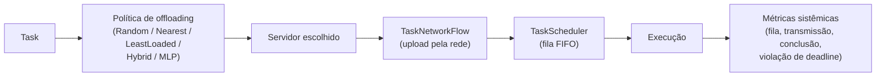
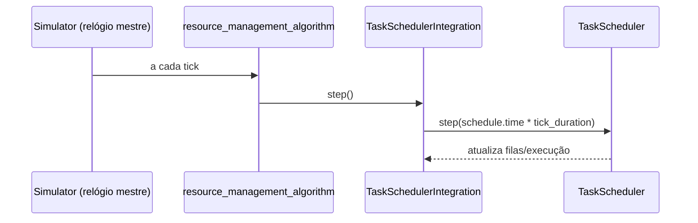
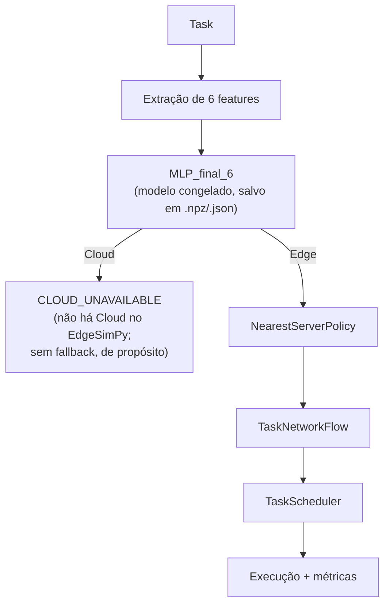
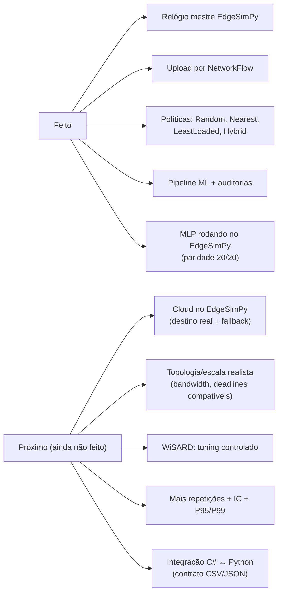

# Apresentação ao orientador — Parte 2: do escalonador ao MLP rodando no EdgeSimPy

> Roteiro da segunda apresentação. Continua a partir de
> `APRESENTACAO_ORIENTADOR_EDGESIMPY.md` (28/08/2026), que terminou com o
> `TaskScheduler` validado de forma isolada e a "Fase 6" como próximo passo.
> Este documento cobre tudo o que foi feito **depois** disso, até 08/10/2026.
> Fonte detalhada: `docs/HISTORICO_EVOLUCAO_EDGESIMPY_TCC.md` e
> `edgesimpy-simulation/results/`.

---

## 0. Como usar este documento

Cada seção é um bloco de fala (ordem sugerida = ordem das seções). Analogias
do cotidiano ajudam a explicar; depois volte sempre ao termo técnico. Tempo
sugerido total: 25–35 min + perguntas.

Visão geral da fala:

1. Recapitulando: onde paramos na última reunião.
2. Fase 6 — o `TaskScheduler` passa a obedecer o relógio do EdgeSimPy.
3. Fase 7 — o dado da Task viaja pela rede (`NetworkFlow`).
4. Fase 8 — primeiras políticas de offloading (Fixed, Nearest, Random) e o caso "local".
5. Fase 9 — unidade de delay: fato medido vs. métrica derivada.
6. Fases 10–13 — políticas sob congestionamento, robustez, heurística híbrida, sensibilidade de pesos.
7. Virada para Machine Learning: auditoria metodológica, contrato X/y, pipeline MLP/WiSARD.
8. Auditoria da fórmula analítica e do feature set (de 5 para 6 features).
9. Integração do MLP no EdgeSimPy.
10. **O bug da dupla normalização** (e a conclusão que eu mesmo retratei).
11. Resultado final corrigido e limitações honestas.
12. O que **não** foi feito (de propósito) e próximos passos.
13. Perguntas prováveis + respostas prontas.

---

## 1. Recapitulando (1 minuto)

Na última reunião eu mostrei:

- EdgeSimPy 1.1.0 auditado; ciclo do `Simulator` entendido; placement (FirstFit, LatencyAware, ResourceAware).
- Modelo de domínio próprio `Task` (com ciclo de vida e timestamps) **independente** do EdgeSimPy.
- `TaskScheduler` com fila FIFO, 1 Task por servidor, memória temporária — testes A–E passando.
- Mas o `TaskScheduler` rodava **sozinho**, sem rede, sem Cloud, sem decisão, sem ML, sem ligação com o C#.

**Hoje a mensagem central é:** esse "motor" isolado virou um pipeline completo —



e, por cima dele, um **MLP treinado com dados do simulador C#** passou a
tomar a decisão — com uma auditoria rigorosa que encontrou e corrigiu bugs.

**Analogia:** antes eu tinha construído só o "caixa da padaria". Agora o
cliente (Task) escolhe a padaria (política), caminha até ela (rede), espera
na fila (scheduler) e é atendido (execução) — e eu meço o tempo de cada etapa.

---

## 2. Fase 6 — Integração com o relógio do EdgeSimPy (04/09)

**Problema:** o `TaskScheduler` ainda tinha vida própria. Eu precisava que o
**EdgeSimPy fosse o único relógio** ("relógio mestre").

**Decisão (justificada lendo o código, não por palpite):**

- Plugar o scheduler via `resource_management_algorithm` (`user_defined_functions`) — mecanismo **oficial** do EdgeSimPy; nenhum arquivo do framework foi modificado.
- Tempo sempre derivado: `current_time_s = schedule.time * tick_duration`.
- O `TaskScheduler` não guarda nenhum "tempo atual" próprio → **não existe relógio paralelo**.



**Resultado (determinístico, 10/10 validações):**

| Tick | Tempo | Task A | Task B | Fila |
|---|---|---|---|---|
| 0 | 0s | executando | em fila | 1 |
| 2 | 2s | concluída | executando | 0 |
| 4 | 4s | concluída | concluída | 0 |

A Task B esperou exatamente 2s (queue time) — o mesmo comportamento já
validado de forma isolada, agora sincronizado com o simulador real.

**Analogia:** é como tirar o relógio de pulso de cada funcionário e deixar só o
relógio da parede do escritório — todos passam a concordar sobre "que horas são".

---

## 3. Fase 7 — O dado da Task viaja pela rede (05/09)

**Objetivo:** antes de executar, a Task precisa **enviar seus dados** (upload)
do usuário até o `EdgeServer` escolhido, usando o `NetworkFlow` nativo.

Lembrete da última reunião: `NetworkFlow` no EdgeSimPy é feito para camadas de
container, não para Tasks. Então criei a classe **`TaskNetworkFlow`** (em
`src/integration/`), que usa o `NetworkFlow` do framework **por fora**, com
`metadata={"type":"task_input","task_id":...}`, sem alterar o EdgeSimPy.

Decisões e fatos verificados:

- `source` = switch da estação base do usuário; `target` = EdgeServer escolhido.
- Caminho por Dijkstra (`nx.shortest_path`, `weight="delay"`).
- Progresso do flow: `data_to_transfer -= min(bandwidth)` por tick (bandwidth via `max_min_fairness`).
- Hipótese **declarada** (não escondida): `data_size_mb * 1024` para a unidade do flow.

**Resultado do experimento de validação:** 102,4 KB trafegaram pelo caminho
`[4,3,2,5,9]` em **8 ticks (8,0 s)**, com `tempo = (end - start) * tick_duration`.

Depois, o `TaskScheduler` foi acoplado à rede com a regra:

> Task só entra na fila de execução **depois** que o upload termina (teste `test_task_scheduler_with_network.py`, 10/10, reexecutado em 08/10).
> Os tempos são derivados do relógio do EdgeSimPy. Observação: o flow começa em `steps + 1`, então o tempo de resposta tem um offset de 1 tick em relação à soma `transmissão + fila + execução` (ex.: 16 + 2 + 1 = 19s de componentes, resposta 20s).

**Analogia:** o pedido só entra na fila da cozinha depois que o motoboy
terminou de entregar os ingredientes; o relógio de cada etapa é medido.

---

## 4. Fase 8 — Primeiras políticas de offloading (05/09)

Criei uma abstração **`OffloadingPolicy`** (equivalente em Python ao
`IOffloadingStrategy` do C#), mantendo a regra de ouro:

> **A política só decide o destino. Quem executa é a infraestrutura.**

Políticas iniciais (`src/policies/offloading.py`): `FixedServerPolicy`,
`NearestServerPolicy` (menor delay de caminho) e `RandomPolicy` (com seed).

**Experimento controlado:** 1 Task enviada para cada um dos 6 EdgeServers
(um `Simulator` novo por destino, porque o EdgeSimPy guarda estado global).

| Destino | Hops | Transmissão | Conclusão | Deadline (10s) |
|---|---:|---:|---:|---|
| EdgeServer 3 (local) | 0 | 0s | **2s** | cumprida |
| EdgeServers 1,2,4,5,6 | 1–4 | 8s | 11s | violada |

**Achados importantes:**

1. **Caso local sem hops:** o `NetworkFlow` do EdgeSimPy quebra com caminho de zero enlaces (`min()` sobre lista vazia). Tratei como transmissão de duração zero **na minha camada**, sem mexer no framework.
2. **Limitação descoberta:** no EdgeSimPy 1.1.0 o *delay* do caminho **não** entra no tempo do flow — todos os remotos levaram 8s mesmo com 1 ou 4 hops. Declarei isso explicitamente em vez de esconder.

---

## 5. Fase 9 — Unidade de delay: o que é medido e o que é derivado (07/09)

O EdgeSimPy não declara a unidade de `NetworkLink.delay`. Em vez de assumir
em silêncio, adotei uma **convenção do cenário do TCC**, registrada na config:

```text
delay_unit = "ms"        (hipótese do TCC, não afirmação sobre o EdgeSimPy)

transmission_time_s              -> MEDIDO no NetworkFlow
path_delay_ms                    -> soma dos delays do caminho
propagation_delay_s              = path_delay_ms / 1000
derived_communication_latency_s  = transmission_time_s + propagation_delay_s   (DERIVADO)
```

`completion_time_s` continua sendo só o que o scheduler observou — a latência
derivada é uma métrica **adicional**, nunca altera o relógio. Isso separa
"fato medido pelo ambiente" de "cálculo externo do TCC".

---

## 6. Fases 10–13 — Comparando políticas sob carga (07/09)

### 6.1 Congestionamento (3 Tasks, servidores E2 e E5)

Criei a `LeastLoadedPolicy` (menor contagem de Tasks já admitidas na rodada —
baseline de distribuição do TCC, **não** uma métrica nativa do EdgeSimPy).

| Política | Destinos A/B/C | Violações | Conclusão média |
|---|---|---:|---:|
| Nearest | E5/E5/E5 | **3** | 29s |
| LeastLoaded | E2/E5/E2 | 1 | 17s |
| Random (seed) | E2/E2/E5 | 1 | 17s |

**Achado contraintuitivo:** o servidor **mais perto** (Nearest) foi o **pior**,
porque concentrou os 3 uploads no mesmo enlace (24s por Task em vez de 8–16s).

**Analogia:** é o motorista que sempre escolhe o pedágio mais próximo — se
todos fazem igual, o pedágio "mais perto" vira o mais congestionado.

### 6.2 Robustez (1, 2, 3, 5 e 8 Tasks; Random com 5 seeds)

| Tasks | Nearest (violações) | LeastLoaded (violações) | Conclusão média N vs L |
|---:|---:|---:|---|
| 1 | 0% | 0% | 11s vs 11s (empate) |
| 2 | 50% | 0% | 20s vs 11s |
| 3 | 100% | 33% | 29s vs 17s |
| 5 | 100% | 80% | 47s vs 25,4s |
| 8 | 100% | 100% | 75s vs 38s |

Leitura honesta: distribuir **sempre reduz** a latência, mas com 8 Tasks
**nenhuma política salva a deadline** — a infraestrutura satura.

### 6.3 Heurística híbrida (delay + carga) e sensibilidade de pesos

`HybridHeuristicPolicy`: `custo = w_delay·delay_norm + w_load·load_norm`,
com pesos **definidos a priori** (0,5/0,5), não ajustados depois de ver o resultado.

- Com 2 candidatos, Hybrid ≈ LeastLoaded (sem ganho adicional).
- Na análise de sensibilidade (grade `(0,1)…(1,0)`, 3 cenários de conflito
  delay × carga): `w_delay=0` reproduz LeastLoaded, `w_delay=1` reproduz
  Nearest, e pesos intermediários **divergem** de LeastLoaded em alguns cenários.
- **Decisão metodológica:** **nenhum peso foi eleito "o melhor"** — escolher o
  menor resultado observado seria *tuning pós-hoc*.

**Frase para o orientador:** "Fiz questão de não otimizar pesos olhando o
resultado; deixei os pesos como fator experimental."

---

## 7. Virada para Machine Learning (07/09)

### 7.1 Auditoria metodológica antes de treinar qualquer coisa

Formulei o problema antes de codar:

```text
X -> y in {Edge, Cloud}      (compatível com o C#)
Fluxo: X -> modelo -> Edge/Cloud -> (se Edge) política escolhe o servidor -> EdgeSimPy
```

Pontos de rigor levantados:

- **Circularidade:** o rótulo `BestDestination` é gerado pela fórmula do `EdgeCloudSimulator` (C#). O modelo aprende a **fórmula**, não a "física real". Por isso a avaliação final é no EdgeSimPy, com **métricas sistêmicas** (accuracy/F1 ficam secundárias).
- **Leakage:** `TotalResponseTime*`, `ExecutionTime*` e `BestDestination` **proibidos em X**.
- **Features sem equivalente observável** no EdgeSimPy (CPU/RAM/fila do Edge, Cloud) não podem ser inventadas.

### 7.2 Contrato de dados e pipeline

- Dataset: 15.000 amostras (62,4% Edge / 37,6% Cloud), split estratificado 70/15/15 com seeds fixas (`source_seed=42`, `split_seed=43`), versionado em metadata.
- Pré-processamento (min-max) ajustado **só no treino** (teste anti-leakage).
- Modelos portados do C#, **sem dependências de ML** para o modelo em si: **MLP** (18 neurônios, lr 0,04, 35 épocas, seed 11), **WiSARD** (4 bits/feature, RAM 8, seed 7) e baseline de maioria.

### 7.3 Primeiro resultado (5 features) — conjunto de teste

| Modelo | Accuracy | F1 Edge | F1 Cloud |
|---|---:|---:|---:|
| Majority | 62,4% | 0,769 | 0,000 |
| WiSARD | 62,4% (colapsou p/ maioria) | 0,769 | 0,000 |
| **MLP** | **74,4%** | 0,800 | 0,642 |

O WiSARD colapsou (sempre prevê Edge) — configuração atual insuficiente;
**não foi feito tuning** de propósito (registrado como próximo passo).

---

## 8. Auditoria da fórmula e do feature set (07–10/09)

### 8.1 Reconstruí a fórmula que gera os rótulos

```text
T_edge  = CpuCycles/12e6 · (1 + EdgeCpu/100) · penalidade_mem  +  fila_edge
T_cloud = CpuCycles/60e6 · (1 + CloudCpu/180)  +  fila_cloud
          + upload (TaskSizeMB·8/BandwidthMbps·1000)
          + NetworkLatencyMs·(1 + LatencySensitivity)

BestDestination = Edge se T_edge < T_cloud, senão Cloud
```

Descobertas: **`DeadlineMs` não entra na fórmula** (redundante para decidir);
o Edge é favorecido estruturalmente (não paga upload nem rede); só 0,62% das
amostras estão perto da fronteira (então os erros do MLP não eram ambiguidade).

### 8.2 O contrato de 5 features estava errado

`BandwidthMbps` e `NetworkLatencyMs` são **causais** (entram em T_cloud) e foram
removidas por engano; `DeadlineMs` era **não causal** e estava incluída.

| Conjunto de features | Nº | Accuracy (teste) |
|---|---:|---:|
| `no_deadline` | 4 | 73,6% |
| `current` (original) | 5 | 74,4% |
| **`X_final`** (sem Deadline, com Bandwidth+NetLatency) | **6** | **83,2%** |
| `causal_observable_7` | 7 | 83,5% |

Conclusão: **+8,8 pp** só por corrigir o contrato, e `DeadlineMs` é mesmo
irrelevante (6 ≈ 7 features). Contrato final:

```text
X_final = [CpuCycles, TaskSizeMB, LatencySensitivity,
           RequiredMemoryMB, BandwidthMbps, NetworkLatencyMs]
```

**Analogia:** o aluno tirava 7,4 porque estudava com o resumo errado (faltavam
2 capítulos cobrados e sobrava 1 não cobrado). Corrigi o resumo e a nota subiu
para 8,3 **sem mudar o aluno** (mesmo MLP, mesmos hiperparâmetros).

---

## 9. Integração do MLP no EdgeSimPy (08/09)

Arquitetura (política de 2 níveis, decisão separada da execução):



Pontos de rigor: modelo serializado e **congelado** (sem retreino); workload
representativo de 20 Tasks (10 Edge + 10 Cloud pelo rótulo), com **IDs de
amostras congelados** e seed registrada; comparação contra Random, Nearest,
LeastLoaded e Hybrid em 1/2/3/5/8 Tasks.

> Decisão consciente: **não** implementei Cloud no EdgeSimPy nem fallback. Uma
> Task prevista como Cloud é marcada `CLOUD_UNAVAILABLE` — assim a cobertura
> de execução do MLP é reportada à parte, sem mascarar nada.

---

## 10. O momento de maior rigor: a conclusão que eu retratei (09/09)

### 10.1 O sintoma

| | Offline (teste) | No EdgeSimPy (20 tasks 50/50) |
|---|---|---|
| Accuracy | 83,2% | **50%** |
| Predições | Edge e Cloud | **100% Edge** |

Primeira (errada) interpretação: "o MLP tem *viés Edge*". **Desconfiei** porque
um modelo com 83% offline não deveria colapsar por completo → abri uma
**auditoria de paridade treinamento → inferência**.

### 10.2 Três bugs encontrados (todos de pipeline, nenhum do modelo)

| # | Bug | Efeito | Correção |
|---|---|---|---|
| 1 | **Dupla normalização** em `MLPOffloadingPolicy.predict()` (normalizava e o modelo normalizava de novo) | features colapsam para ~0 → saída < 0,5 → sempre Edge | passar features **raw** ao `model.predict()` |
| 2 | Workload/execução: amostras re-sorteadas em vez de IDs congelados; Task recriada com valores diferentes; `processing_rate=50 cycles/s` impossível p/ tasks de ~10⁹ ciclos; deadline sintética | 0 tasks executadas | IDs congelados, **mesma Task** da decisão à execução (assertion de 7 propriedades), 12 GHz (igual ao C#), deadline do dataset |
| 3 | **Semântica diferente** de `BandwidthMbps`/`NetworkLatencyMs`: no C# são condição **WAN usuário→Cloud por amostra**; no runtime eram derivadas da topologia Edge (valores fixos, fora da distribuição de treino) | decisões degradadas | a `Task` passa a carregar as condições WAN do cenário; cálculo topológico vira fallback documentado |

Evidência do bug 1 (validation set inteiro): `predict(X_normalizado)` →
2250 Edge / 0 Cloud (≈ proporção da classe majoritária); `predict(X_raw)` →
1495 Edge / 755 Cloud (≈ 81,6%).

**Analogia:** é como converter Celsius para Fahrenheit duas vezes: 20 °C vira
68 °F e depois "68 °C" → 154 °F. O termômetro (modelo) estava certo; o erro
estava na tradução antes de ele ler o número.

### 10.3 Registro honesto

A conclusão "MLP tem viés Edge" foi **explicitamente marcada como RETRAÍDA** no
histórico (`HISTORICO_EVOLUCAO_EDGESIMPY_TCC.md`) e substituída. Isso é
parte do método: o documento mostra o erro **e** a correção.

---

## 11. Resultado corrigido e limitações (correção em 09/09; reexecutado em 08/10)

> Reexecutados em 08/10 e idênticos ao relatório: `test_mlp_policy_parity.py`
> (20/20, todos PASS), `experimento_mlp_workload_representativo.py`
> (11 Edge / 9 Cloud, acc 0,850, 17.757 steps), `experimento_robustez_politicas.py`
> e `test_task_scheduler_with_network.py` (10/10). Os arquivos de `results/`
> não mudaram (git limpo), o que confirma o determinismo.

### 11.1 Paridade e decisão

- Teste de invariância `test_mlp_policy_parity.py`: **20/20 exatos** (dataset → modelo == Task → política, inclusive nas saídas contínuas); save→load idêntico; preprocessing idêntico.
- Workload congelado de 20 Tasks:

| Métrica | Valor |
|---|---|
| Predições | 11 Edge / 9 Cloud (Cloud ≈ 45%, coerente com 50/50) |
| Accuracy | **0,850** (consistente com 83,2% offline; n=20, ruído amostral) |
| Matriz de confusão | [[9,1],[2,8]] |
| F1 Edge / Cloud | 0,857 / 0,842 |
| Executadas (Edge) | 11 · `CLOUD_UNAVAILABLE`: 9 |

### 11.2 O que **não** se pode concluir ainda (dizer isso é força, não fraqueza)

1. **100% de violação de deadline nas Tasks Edge executadas** (transmissão média ≈ 4.800 s). Causa: a convenção `MB*1024` sobre links de 12,5 unidades/tick da **topologia de tutorial**, incompatível com deadlines de 0,3–5,9 s do dataset. É limitação da **infraestrutura/convenção**, não da qualidade da decisão do MLP. **Não** devo apresentar isso como "MLP é ruim" nem como "MLP é bom".
2. **Sem Cloud no EdgeSimPy:** 45% das Tasks não executam; comparação sistêmica MLP × baselines Edge-only **não é maçã com maçã** (o relatório diz isso explicitamente).
3. **Circularidade permanece:** o MLP imita a fórmula C#. O que o EdgeSimPy valida é se a decisão tem consequências razoáveis, não que ela seja "fisicamente ótima".
4. Amostra pequena (20 Tasks, 1 usuário, 2 servidores, 1 repetição determinística); sem intervalos de confiança.
5. Features WAN vêm da Task (dado do cenário); em produção seriam medidas.
6. WiSARD ainda colapsado e sem tuning.
7. O `experimento_comparativo_sistemico.py` (MLP × 4 baselines em 1–8 Tasks) ainda usa `processing_rate = 50 cycles/s` e Tasks sintéticas pequenas; a tabela da Fase 14 original ("MLP = Nearest") foi gerada **antes** da correção do bug e não vale mais. Apresente a comparação sistêmica como "pipeline funcional, resultados a refazer após Cloud/topologia", não como conclusão.

---

## 12. O que foi feito de propósito **antes de avançar** vs. o que falta



Checklist de status (slide de fechamento):

```text
[x] Fase 6  TaskScheduler sincronizado ao relógio do EdgeSimPy (sem relógio paralelo)
[x] Fase 7  Upload da Task via NetworkFlow + scheduler só executa após upload
[x] Fase 8  Camada OffloadingPolicy (Fixed, Nearest, Random) + caso local sem hops
[x] Fase 9  Convenção de unidade de delay (ms) + métrica derivada separada da medida
[x] Fase 10-13  Congestionamento, robustez, Hybrid, sensibilidade de pesos (sem tuning pós-hoc)
[x] Auditoria de ML: formulação, circularidade, leakage
[x] Contrato X/y versionado + split reproduzível
[x] Pipeline MLP / WiSARD / Majority
[x] Auditoria da fórmula analítica e correção do feature set (5 -> 6 features, 74,4% -> 83,2%)
[x] MLP_final_6 integrado ao EdgeSimPy (decisão separada da execução)
[x] Auditoria de paridade: 3 bugs de pipeline corrigidos; conclusão "viés Edge" retraída
[ ] Cloud no EdgeSimPy / fallback
[ ] Topologia realista (resolver 100% de violação por transmissão)
[ ] Tuning do WiSARD
[ ] Mais repetições / intervalos de confiança
[ ] Integração C# <-> Python via contrato
```

**Próximo passo proposto:** implementar uma representação de Cloud (nó/rota
WAN com os parâmetros por amostra) para que Tasks previstas como Cloud
**executem** e a comparação MLP × baselines seja justa; em paralelo, calibrar
a topologia/convenção de unidades para que as deadlines do dataset sejam
atingíveis, evitando saturar tudo em 100% de violação.

---

## 13. Perguntas prováveis do orientador (com respostas prontas)

**"O MLP chegou a 83%; isso prova que ele é bom?"**
Prova que ele **aprendeu a fórmula do simulador C#** bem. Como o rótulo vem
dessa fórmula, há circularidade — por isso a validação é no EdgeSimPy com
métricas sistêmicas, e accuracy é só métrica secundária.

**"Por que você retratou a conclusão do viés Edge?"**
Porque a auditoria de paridade mostrou que o modelo salvo/carregado era
idêntico e produzia Cloud corretamente com dados raw; o 100% Edge vinha de
dupla normalização na política. Manter a conclusão errada seria pior do que
registrar o erro.

**"Por que 100% de violação de deadline? A política é ruim?"**
Não dá para concluir isso. A transmissão domina (`MB*1024` sobre links de
12,5/tick da topologia de tutorial) e as deadlines do dataset são de
segundos. É uma incompatibilidade de escala da infraestrutura, e já está
registrada como limitação e próximo passo.

**"Por que Cloud não está implementada?"**
Decisão deliberada: primeiro garantir paridade e corretude do que existe.
Tasks previstas como Cloud viram `CLOUD_UNAVAILABLE` em vez de serem forçadas
para o Edge, para não mascarar a cobertura.

**"Por que não escolheu o melhor peso da heurística híbrida?"**
Escolher o melhor peso depois de ver os resultados é *tuning pós-hoc*. Os
pesos são tratados como fator experimental; uma calibração futura precisaria
de conjuntos separados de calibração e avaliação.

**"Você alterou o EdgeSimPy?"**
Não. Nenhum arquivo em `edgesimpy-source/` foi modificado; tudo é camada
externa (`integration/`, `policies/`, `execution/`, `ml/`).

**"Isso já conversa com o C#?"**
Parcialmente: o **dataset e a fórmula** do C# alimentam o treino do MLP
(contrato CSV versionado). A integração em tempo de execução C# ↔ Python
segue como próximo passo.

**"Por que Nearest foi o pior?"**
Porque concentra tudo no servidor mais próximo e satura o mesmo enlace.
"Mais perto" não é "melhor" quando há contenção — e isso só aparece porque
a simulação modela fila e banda, o que o modelo analítico sozinho não mostra.

---

## 14. Onde encontrar cada coisa

| O quê | Onde |
|---|---|
| Integração com o relógio | `edgesimpy-simulation/src/integration/task_scheduler_integration.py` |
| Upload da Task | `edgesimpy-simulation/src/integration/task_network_flow.py` |
| Métricas de comunicação | `edgesimpy-simulation/src/integration/communication_metrics.py` |
| Políticas (Random, Nearest, LeastLoaded, Hybrid) | `edgesimpy-simulation/src/policies/offloading.py` |
| Política MLP | `edgesimpy-simulation/src/policies/ml_offloading.py` |
| Pipeline ML (dataset, MLP, WiSARD, métricas) | `edgesimpy-simulation/src/ml/` |
| Modelo congelado | `edgesimpy-simulation/models/mlp_final_6.npz` / `.json` |
| Teste de paridade | `edgesimpy-simulation/src/test_mlp_policy_parity.py` |
| Experimentos de política | `src/experimento_offloading_destinos.py`, `..._multiplas_tasks.py`, `..._politicas_congestionamento.py`, `..._robustez_politicas.py`, `..._heuristica_offloading.py`, `..._sensibilidade_heuristica.py` |
| Experimentos de ML | `src/experimento_4_mlp.py`, `src/experimento_mlp_edgesimpy.py`, `src/experimento_mlp_workload_representativo.py`, `src/experimento_comparativo_sistemico.py` |
| Auditoria da fórmula / features | `results/auditoria_formula_analitica.md`, `results/analise_feature_set.md` |
| Relatório da auditoria de paridade | `edgesimpy-simulation/results/PARITY_AUDIT_REPORT.md` |
| Histórico completo | `docs/HISTORICO_EVOLUCAO_EDGESIMPY_TCC.md` |

Comandos para demonstrar ao vivo (a partir de `edgesimpy-simulation`):

```powershell
.\.venv\Scripts\python.exe src\test_task_scheduler_with_network.py
.\.venv\Scripts\python.exe src\experimento_politicas_congestionamento.py
.\.venv\Scripts\python.exe src\test_mlp_policy_parity.py
```

> Dica: o `experimento_mlp_workload_representativo.py` simula ~17.700 steps e
> pode demorar; para ao vivo, prefira o teste de paridade, que é rápido.

---

## 15. Roteiro de fechamento (30 segundos)

"Na última reunião eu tinha um motor de execução de Tasks isolado. Hoje ele é
um pipeline completo — relógio do EdgeSimPy, upload pela rede, políticas de
offloading e um MLP treinado com dados do simulador C# — e eu o validei com
auditorias. A parte mais importante foi **encontrar e corrigir três bugs de
pipeline e retratar uma conclusão errada**. O MLP agora tem paridade exata
entre treino e inferência (20/20) e 85% de acerto no workload. O próximo
passo é implementar a Cloud no EdgeSimPy e calibrar a topologia para que a
comparação sistêmica seja justa."
